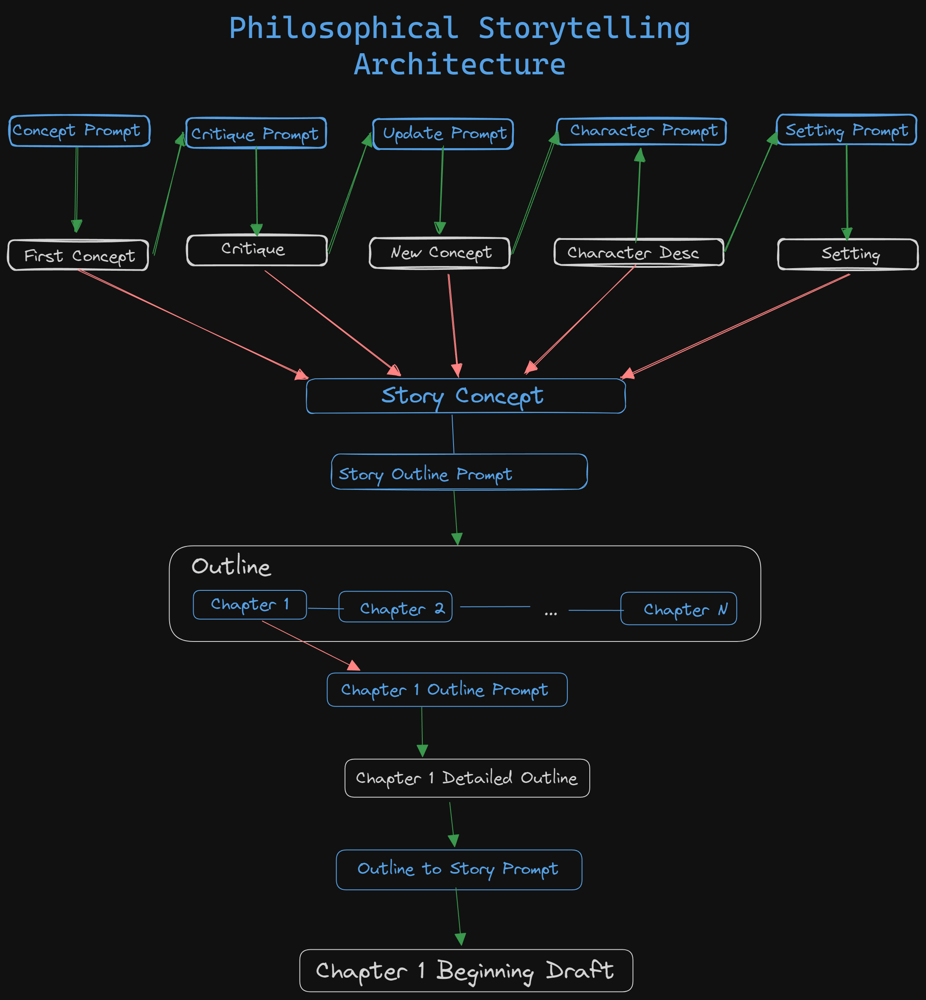

# Generate a Story Concept from Philosopher Critique
If you've never engaged in a conversation with a LLM (Large Language Model) chatbot, you really should. 
Don't worry, we'll use examples to illustrate so the process is as painless as possible. 

## Prompt Engineering Notes
Go to [ChatGPT] and paste this prompt:
>Invoking the philosophical ideas of Albert Camus, generate two labelled paragraphs. A story concept that embodies and encapsulated their key themes. Provide: I. A captivating title. II. A brief paragraph summary of the story concept. III. A paragraph about the central themes that the story will address, reflecting Camus's perspectives on possible futures.

Now, do the same in [Zephyr Chat]. Notice how the responses are similar, but not exact. This was intentional. It was a process of rewording the prompts painstakingly so that they come up with exactly what you see, the way you see it: a title, story concept, and central themes. It sounds more magical than in practice. It was a matter of crafting in ChatGPT first and then confirming the response in Zephyr, making some small changes and then going back to ChatGPT for a final confirmation. It only took going through this process twice so there was little point to heavy documentation.

Here is a flow chart describing the process:

Here are the rest of the prompts to use to continue the conversation. Personally, I thought Zephyr was actually more creative but ChatGPT is obviously more forgiving for lack of clairity. Let's start by getting a critique from another philosopher:
>Considering possible critiques of the story concept and themes by Jean-Paul Sartre, and their philosophical viewpoints. Write a paragraph assessing how
Sartre might challenge or enrich the narrative and a second paragraph discussing any potential conflicts or resonances between Camus's and Sartre's ideas.`

Then updating the story so far based on the critique:
>Update the title, story concept and themes considering Sartre's critique. Keep in mind I am writing from the male perspective. Do not mention any philosophy or philosophers in your response.`

Now we are ready to develop a character:
>Use the information in the Concept Summary and Themes to develop a Main Character. Create a three paragraph description for the protagonist in detail, ensuring that they align with the central themes and philosophies explored in the story. Give Physical, Backstory, and Personality description paragraphs.`

And now let's create a setting:
>Use this information in creating a single long paragraph about the setting and world-building elements. Give a detailed description of the world in which the story takes place, ensuring that it resonates with the central themes and philosophies explored in the narrative. Make sure not to develop the plot, just create the basic setting in one paragraph for now.`

## Generate The Beginning of the Story
You'll want to copy, paste, and save the five outputs comprising your story concept that it generates in a notepad (remember, you ONLY need the outputs, not the prompts). All of the outputs from this series of prompts put to together comprise the {Story Details} template tag referenced below that should be added as context for the prompt.

### Prompt that produced a basic outline for the story:
>Given the following descriptions, write an basic plot outline paragraphs, roman numerals for each part. Only discuss the plot and not other aspects of the story. Identify important characters and describe the major events of the story. Do not explain the events or interpret them in any way; merely describes what happens.: {Story Details}

### Prompt that produced the outline for the introduction and first part of the story.
>Here is detailed information about an original story. The purpose of the information is only to provide context writing an outline for only a specific part of the story. Write a separate numbered paragraph outline only and only for the events of "I. Introduction". Only work on one part of the plot and do not write one for the entire story.

### Prompt that produced the first draft of the first part of the story.
>Write the first part of the story. Write in the tone of a pioneering science fiction author, known for confident and savvy writing style that plenty of dialogue, blended slang, folk aphorism, technical jargon, clever understatement, apparent casualness, and a concentration on people rather than gadgets. Use a sense of realism to incorporate the great mass of necessary science fiction data without recourse to long descriptive passages and deadening explanations common to earlier science fiction. Use the writing technique of "indirect exposition" .

Congrats! You now have in front of you the first few lines of an original generated story. The cool thing is, every time you do this, it will be a little bit different. Zephyr actually gave me chills a few times. And it goes without saying that you should try other philosophers or authors and possibly tinker with the prompts themselves. 

---

### More Chatbots
There are more chatbots available to try for free:
* [Vercel Playground] is a good resource for also checking the Llama-70B and other OpenAI models that aren't ChatGPT vanilla. You can actually write one prompt and get responses from several chatbots simultaneously.
* [Chatbot Arena] is cool for checking the more of the capabilities of open source models side by side in a similar manner to Vercel. This is also a good time to mention that Huggingface is a name that is going to come back. If you have any inclination to continue with this process, you might as well take a look around.

---

Now that we have a grasp of that process and those tools, you might be wondering how we might finish our book with this method. It is definitely an option to generate more in this manner. But for fun, let's start to take a look at the tools we mostly use to automate this process. Click the button below to get started:

Keep in mind that there are usage limits on Google Colab GPU access. Normally we can get at least an hour or two of GPU time each day.

[Chatbot Arena]:https://chat.lmsys.org/

[Vercel Playground]:https://sdk.vercel.ai/

[Zephyr Chat]:https://huggingface.co/spaces/HuggingFaceH4/zephyr-chat

[ChatGPT]:https://chat.openai.com/
